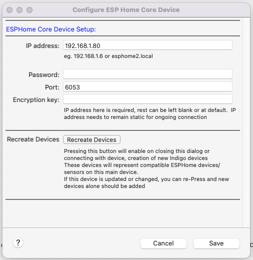

This is a plugin for Indigo (**Indigodomo**) to allow direct access to some ESPHome sensor devices, and growing over time switches/action devices.   This connects directly, locally to the ESPHome device via local network and requires nothing further.  The ESPHome device needs api enabled.
ESPHome is a complex, fantastic project and overtime has become very mature/stable.

Many thanks for enormous man hours of maintaining updating this project - it truly is an impressive feat.

###### So What is ESPHome?  (What follows is my, likely limited understanding)

It is essentially firmware for a number of microprocessors, most common, and most powerful the ESP32.

The ESP32, such as this relatively expensive $22USD one: (https://www.sparkfun.com/products/15663)

#### Sparkfun Thing Plus:

This includes a processor, memory, wifi connection, a number of pins for connection sensors/devices.

**Oh shit, I read this far and how this seems far to complicated?**

Hold off for a couple of minutes….
Sure it sounds somewhat complicated, but actual setup is straightforward.

This above ESP32 option includes a QWIC connection for i2C devices meaning plug and play for a high number of sensors.

But anyway – on to setup.

##### Need:

Need ESP32 (or like device) like above which is $22USD

Plug in to USB port on computer (Possibility some drivers needed depending on PC)

Go to http://web.esphome.io

Press Connect button and find the USB connected device

Install the latest version of ESPHome onto the device via the install button on web

Enter Wifi details – and in a minute or 2 you have a default ESPHome device connected to your wifi.

Admittedly it won’t do much – but it connects and you can visit its web server with its IP in a web-browser.  It also enables Over the Air updates via the web browser where you can upload new firmware.

See very Easy!

So what now?

Now you need to customise the firmware for the device, to do so you need to install esphome (the software responsible for creating the firmware) on a computer.   The firmware is modified depending on the configuration yaml file and is then uploaded to the device, either via Web or via USB.

see:
https://esphome.io/guides/installing_esphome

For me, on a windows device it was as easy as:

Running the below, having already had a python3 install
`pip3 install wheel `

`pip3 install esphome`

Now we have a esphome command (python script) to create the correct firmware for the device.  This does need a yaml file, detailing the device details and any sensors/switches you might have added.
Can start with command, in a directory where yaml file will be saved.

`esphome wizard nameofyaml.yaml`

And this takes you through basic setup options, then pretty easy to add sensors, and other devices as per the instructions.
Once the appropriate code has been downloaded, the firmware bin has been created it then needs to be placed on your new ESPHome device.  This is very easy if can connect via USB, or can use the firmware.bin file and web page for OTA updates.

If you already have a ESPHome device or ‘works with ESPHome device’ then as long as ESPHome api is enabled on the device it we should be able to connect to it with this plugin.
Why this Plugin?

It enables direct Indigo -> Each ESPHome device communication/connection without the need for anything else.
It is a very simple and robust way of getting a huge number of sensors into the Indigo system directly.

Sensor updates, or button presses are immediately  communicated back to Indigo.
**Other options:**
The piBeacon Indigo plugin enables similar sensor support/and much more, but rPI are hard to find, and another level of expense compared to a $5 ESP32.
Alternatively I suspect one of the HA plugins, and then duplicating ESPHome devices from HA into Indigo may also work.
To me this approach is:

1. Simpler.
   Uses an ESP32, firmware avoids the cost, and overhead of RPI/SD-Card, formatting etc.
   Only possible because of ESPHome mind you!
2. Avoids the need for other systems/RPI/Computers running elsewhere and complexity of communication risk.
3. Gives us immediate communication in both directions.

Other time I hope to expand the device control – lights, switches, plugs and enable increased support for these type of ESPHome devices.   (issue being there are a infinite number)

This enables direct support for the huge number of works with ESPHome devices

Okay... So far I haven't mentioned the Plugin...well mainly because I wrote this summary elsewhere and haven't really sorted it out as yet...
But that has all changed in the last 5 hours or soo..

Plugin:

Download.
Install double click.
We do have some dependencies..
`protobuf>=3.19.0
zeroconf>=0.36.0,<1.0
chacha20poly1305-reuseable>=0.2.5
noiseprotocol>=0.3.1,<1.0
async-timeout>=4.0`

noiseprotocol I include
Everything else is already running, with AppleTV plugin and HomeKit plugin using zeroconf and protobuf, but it is possible you may need to in a terminal window
type: eg. for protobuf
`pip3.10 install protobuf`

Essentially Nothing will happen all going well except the plugin will start.

Next create a ESPHome4Indigo Core Device (the only device option)
Name it ideally before much else...

Enter the IP address of you ESPHome device, password and port (defaults to 6053)
Press Save:

All the Sensor devices, and all the Switch devices connected to this ESPHome device will be created in Indigo.
Live updating and ability to turn on/turn off switch devices currently.

If need to recreate Devices as have some changes - delete current devices (sorry might update this aspect)
and then press Recreate Devices.

